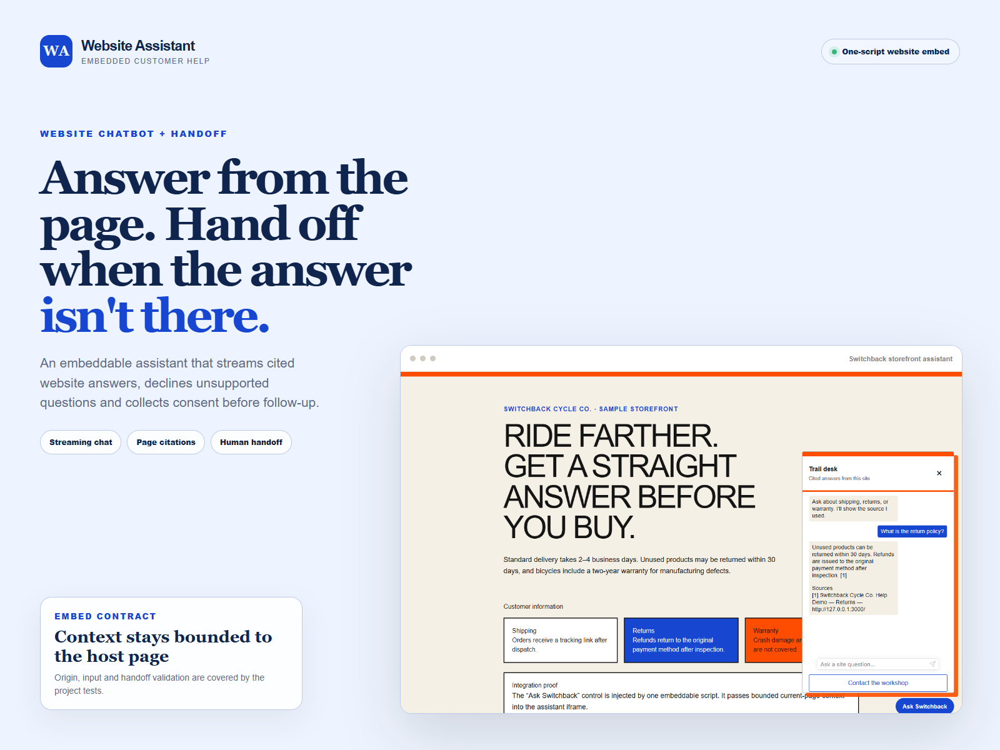

# Switchback website assistant

**Verification:** [claim-to-artifact map and rerun commands](https://sutasmantas.github.io/evidence/#switchback) · [machine-readable receipt](https://sutasmantas.github.io/evidence/receipt.json)

A website-assistant integration that embeds with one script, passes bounded
current-page context, streams cited answers through an Atlas-compatible
contract, declines unsupported questions, and sends consented leads through an
idempotent handoff.



[Open the live website assistant](https://sutasmantas.github.io/website-ai-assistant/)

## Try it locally

Requirements: Node.js 22.13 or newer.

```powershell
npm ci
npm run dev
```

Open `http://localhost:3000`, choose **Ask Switchback**, and try:

- `How long does shipping take?` — streamed answer with a page citation;
- `Do you repair lunar rovers?` — explicit unavailable answer and human path;
- **Contact the workshop** — deterministic accepted handoff with no credentials.

The local provider uses fixed website evidence but exercises the same public
chat and handoff contracts as configured services.

## Optional composition

Set server-side environment variables only:

```text
ATLAS_BASE_URL=https://your-atlas-host
ATLAS_TENANT=public-site
ATLAS_PRINCIPAL=website-widget
HANDOFF_WEBHOOK_URL=https://your-allowlisted-webhook-target
```

`ATLAS_BASE_URL` receives Atlas's existing `POST /api/query/stream` request and
SSE response contract. `HANDOFF_WEBHOOK_URL` receives a versioned JSON event and
stable `Idempotency-Key`; use Relay's generic outbound boundary for destination
policy, durable retry, redaction, and audit in a real workflow.

## Verification

```powershell
npm run lint
npm test
```
